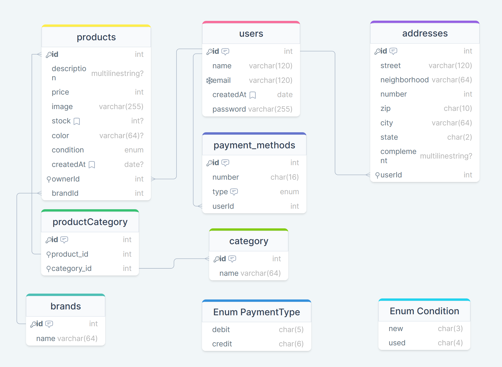

# Durval Music Shop e-commerce back-end

<hr style="border-top: 3px solid #bbb;">

## Descrição

Back-end de aplicação fullstack de um e-commerce de equipamentos musicais
onde usuários podem comprar e vender seus instrumentos.
A motivação da equipe foi de desevolver uma aplicação robusta para compor o portfólio de cada um.

<hr style="border-top: 3px solid #bbb;">

## Índice

- [Visão geral](#visão-geral)
    - [Tecnologias usadas](#tecnologias-usadas)
        - [Node](#node)
        - [Outros](#outros)
    - [Links importantes](#links-importantes)
    - [Funcionalidades](#funcionalidades)
- [Estrutura do projeto](#estrutura-do-projeto)
    - [Relacionamentos](#relacionamentos)
    - [Arquitetura](#arquitetura)
    - [Scripts](#scripts)
    - [Dependências](#dependências)
    - [Dependências de desenvolvimento](#dependências-de-desenvolvimento)
- [Configuração do ambiente local](#configuração-do-ambiente-local)
    - [Instalação](#instalação)
    - [Configuração das variáveis de ambiente](#configuração-das-variáveis-de-ambiente)
    - [Configuração do banco de dados](#configuração-do-banco-de-dados)
    - [Executar o projeto](#executar-o-projeto)
- [Processo de trabalho](#processo-de-trabalho)
    - [Aprendizado](#aprendizado)
    - [O que desenvolver em seguida](#o-que-desenvolver-em-seguida)
    - [Fontes úteis](#fontes-úteis)
- [Créditos](#crédito)
    - [Autores](#autores)
    - [Pessoas que nos ajudaram](#pessoas-que-nos-ajudaram)

<hr style="border-top: 3px solid #bbb;">

## Visão geral

### Tecnologias usadas

#### Node

- Express.js
- Typescript

#### Outros

- Zod
- Json Web Token
- Prisma ORM
- PostgresSQL

### Links importantes

- Deploy frontend:  https://durval-music-shop.vercel.app/
- Deploy backend: https://loja-do-durval.onrender.com/
- Documentação do backend: https://loja-do-durval.onrender.com/doc
- Documentação ambiente local (se ativo): http://localhost:3000/doc

### Funcionalidades

- Criação de usuário e login com geração de token;
- Qualquer usuário pode visualizar uma lista de produtos com paginação;
- Qualquer usuário pode visualizar uma lista de produtos com filtragem por
    - Marca do equipamento musical;
    - Categoria vinculada ao equipamento musical;    
- Usuário autenticado e com permissão pode:
    - Criar, editar ou excluir produtos vinculados a ele;
    - Criar, editar ou excluir endereços vinculados a ele;
    - Criar, editar ou excluir métodos de pagamento vinculados a ele


<hr style="border-top: 3px solid #bbb;">

## Estrutura do projeto

### Relacionamentos



### Arquitetura

```
durval-music-shop-server/
│
├── node_modules/       Dependências instaladas em ambiente local.
│
├── prisma/             Contém as migrações e models do Prisma ORM;
│
├── src/                Código fonte
|   |
│   ├── controllers     Define os tipos de rotas e o que  
                        será recebido da requisição do cliente;                 
|   |
│   ├── errors/         Contém arquivo de como a API trata erros;
                        
|   |
│   ├── interfaces/     Tipagem dos dados recebidos do cliente;
 
|   |         
│   ├── middlewares/    Funções que verificam se a requisição
                        está adequada a um ou mais critérios;
|   |          
│   ├── routers/        Determina o nome das rotas e a
                        aplicação de middlewares;
|   |          
│   ├── schemas/        Impõe a estrutura que será
                        delimitado nas tabelas do banco de dados;
|   |
│   ├── admin/          Diz como a API interage com a requisição
                        do cliente a interage com o banco de dados;

│   ├── app.ts          Inicializa o Prisma ORM e quais endereços Http 
                        podem fazer requisições ao servidor;
│   ├── main.ts         Ativa o servidor;
|                    
│   .env.example        Exemplo de como escrever o .env;
|
│   diagram.png         Visualização gráfica dos relacionamentos 
│                       entre as tabelas;
│   └── ...
```

### Scripts

- `dev`: Inicia o ambiente de desenvolvimento;
- `build`: Usado para construir o aplicativo para produção;
- `start`: Executado para iniciar a aplicação;

### Dependências

- ```````@prisma/client```````: ^5.5.2,
- ```````@types/cors```````: ^2.8.17,
- ````bcryptjs````: ^2.4.3,
- ````cors````: ^2.8.5,
- ````dotenv````: ^16.3.1,
- ````express````: ^4.18.2,
- ````express-async-errors````: ^3.1.1,
- ````jsonwebtoken````: ^9.0.2,
- ````pg````: ^8.11.3,
- ````zod````: ^3.22.4

### Dependências de desenvolvimento

- @types/bcryptjs: ^2.4.6,
- @types/express: ^4.17.21,
- @types/jsonwebtoken: ^9.0.5,
- prisma: ^5.5.2,
- ts-node-dev: ^2.0.0,
- typescript: ^5.2.2

<hr style="border-top: 3px solid #bbb;">

## Configuração do ambiente local

### Instalação

1. Clone o repositório:

```bash
git clone git@github.com:brunomoleta/durval-music-shop-server.git
```

2. Instale as dependências:

```bash
npm install 

ou 

yarn install
```

### Configuração das variáveis de ambiente

Certifique-se de configurar as variáveis de ambiente necessárias no arquivo `.env`, usando com base o `.env.example`, localizado na raiz do projeto.

### Configuração do banco de dados

1. Instalação do PostgreSQL

Certifique-se de ter o PostgreSQL instalado em seu sistema. Você pode baixá-lo em [https://www.postgresql.org/download/](https://www.postgresql.org/download/).

2. Inicialização do Serviço

Após a instalação, inicie o serviço do PostgreSQL. Os comandos podem variar de acordo com o sistema operacional, mas geralmente incluem:

- **Linux:**

```bash
sudo service postgresql start
```

- **Windows:**

Vá para o "Painel de Controle" > "Ferramentas Administrativas" > "Serviços".
Localize o serviço PostgreSQL e inicie-o.

- **MacOS:**

```bash
pg_ctl -D /usr/local/var/postgres start
```

3. Acesso ao banco de dados

Por padrão, o PostgreSQL cria um banco de dados chamado postgres. Você pode acessá-lo usando o utilitário psql no terminal:

```bash
psql -U postgres
```

Isso abrirá uma sessão interativa com o banco de dados postgres usando o usuário postgres. Você pode ser solicitado a fornecer a senha.

4. Criar um Novo banco de dados

Dentro do shell psql, execute o seguinte comando para criar um novo banco de dados:

```bash
CREATE DATABASE nome_do_banco_de_dados;
```

Substitua `nome_do_banco_de_dados` pelo nome desejado para o seu banco de dados.

5. Execute as migrações do Prisma

```bash
npx prisma migrate dev
```

### Executar o projeto

Execute o seguinte comando para iniciar o servidor:

```bash
# desenvolvimento
$ yarn dev

# produção
$ yarn start
```

O servidor local estará acessível em [http://localhost:3000](http://localhost:3000).

- Observação: A porta poderá ser diferente caso tenha configurado de outra forma no `.env`.

<hr style="border-top: 3px solid #bbb;">

## Processo de trabalho

### Aprendizado

- A proposta inicial veio de um hackaton onde não tinhamos nenhum pré requisito a não ser "e-commerce";
- Por isso foi enriquecedor pensar no funcionamento do app para então criar a tabela de relacionamentos;
- No momento em que é criado um ```product``` ocorre também a criação de uma ```brand``` e de uma
ou mais ```category```. Este foi um desafio que não tinhamos nos deparado anteriormente e
que teve um resultado que nos satisfez;
- Ou seja, não há rota específica para ``category`` ou ``brand``, a edição é sempre simultânea ao ``product``;

````javascript
//products.service.ts
const product: Product = await prisma.product.create({
  data: {
    //...
    brand: {
      connectOrCreate: {
        where: { name: data.brandName },
        create: { name: data.brandName },
      },
    },
    //...
    
    categories: {
      create: categories?.map((categoryName) => ({
        category: {
          connectOrCreate: {
            where: { name: categoryName },
            create: { name: categoryName },
          },
        },
      })),
    },
  }})
````
Há um ````map```` em ````categories```` pois a requisição trás um ``array``,
já o ``brand`` envia uma ``string``.


### O que desenvolver em seguida

- Feat de finalização da compra pelo usuário;
- Hash do ``card``(método de pagamento) similar a o que ocorre com uma ``password``;
- Wishlist do usuário para que este guarde seus itens favoritos para comprar em
outro momento;

### Fontes úteis

- [Editor do Swagger](https://editor.swagger.io/) - Mostra em tempo real a documentação do Swagger que está
  sendo montada;

<hr style="border-top: 3px solid #bbb;">

## Crédito

### Autores

- Bruno Moleta;
- Gustavo Lazarin;
- Filipe Otávio;
- João Pedro;

### Pessoas que nos ajudaram

- Mestre Alex Conder (Kenzie Academy Brasil)

<hr style="border-top: 3px solid #bbb;">
